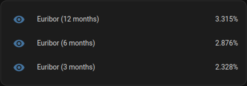

 
# Home Assistant Euribor Rates

**Euribor Rates** information is provided by [euribor-rates.eu](https://www.euribor-rates.eu/en/).

# Screenshots




# Instructions

1. Add this block to 'configuration.yaml'

 ```yaml
    scrape:
  - resource: https://www.euribor-rates.eu/pt/
    scan_interval: 7200
    sensor:
      - name: Euribor (12 months)
        select: ".table > tbody:nth-child(1) > tr:nth-child(5) > td:nth-child(2)"
        unit_of_measurement: "%"
        value_template: '{{ value.split(" ")[0].replace(",", ".") }}'
        unique_id: euribor_12months

  - resource: https://www.euribor-rates.eu/pt/
    scan_interval: 7200
    sensor:
      - name: Euribor (6 months)
        select: ".table > tbody:nth-child(1) > tr:nth-child(4) > td:nth-child(2)"
        unit_of_measurement: "%"
        value_template: '{{ value.split(" ")[0].replace(",", ".") }}'
        unique_id: euribor_6months

  - resource: https://www.euribor-rates.eu/pt/
    scan_interval: 7200
    sensor:
      - name: Euribor (3 months)
        select: ".table > tbody:nth-child(1) > tr:nth-child(3) > td:nth-child(2)"
        unit_of_measurement: "%"
        value_template: '{{ value.split(" ")[0].replace(",", ".") }}'
        unique_id: euribor_3months

```

